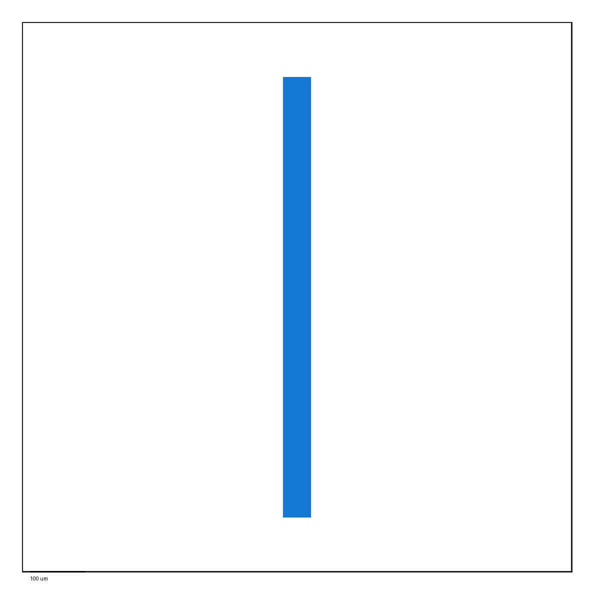
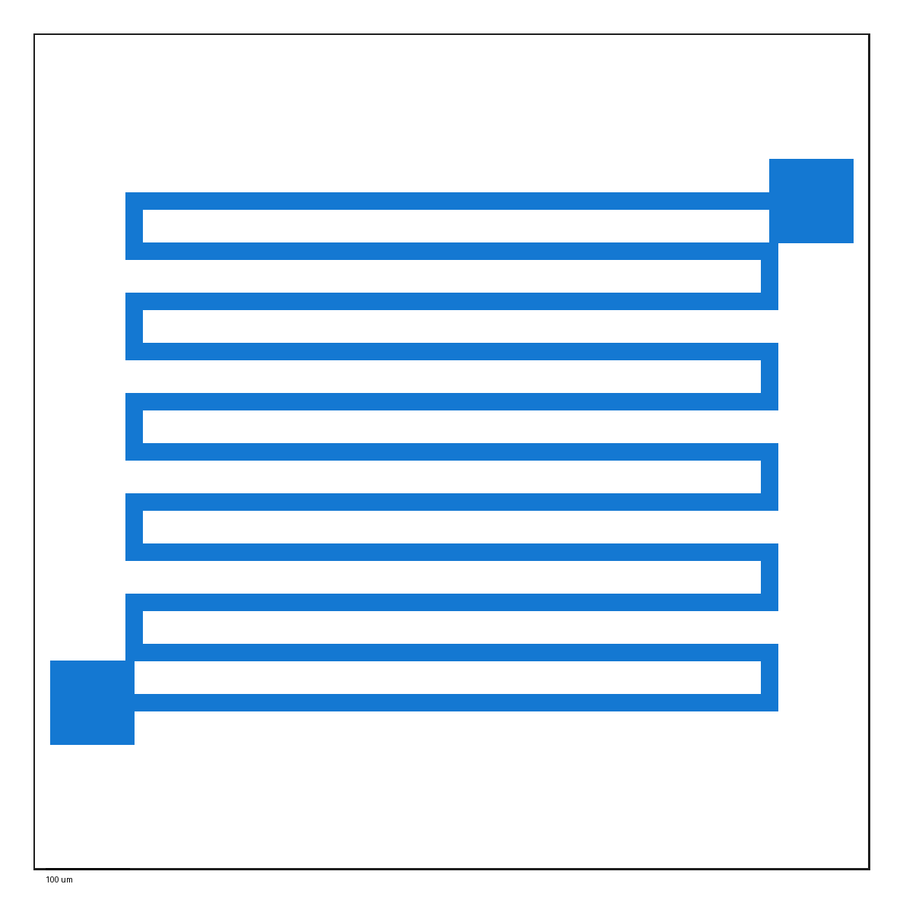
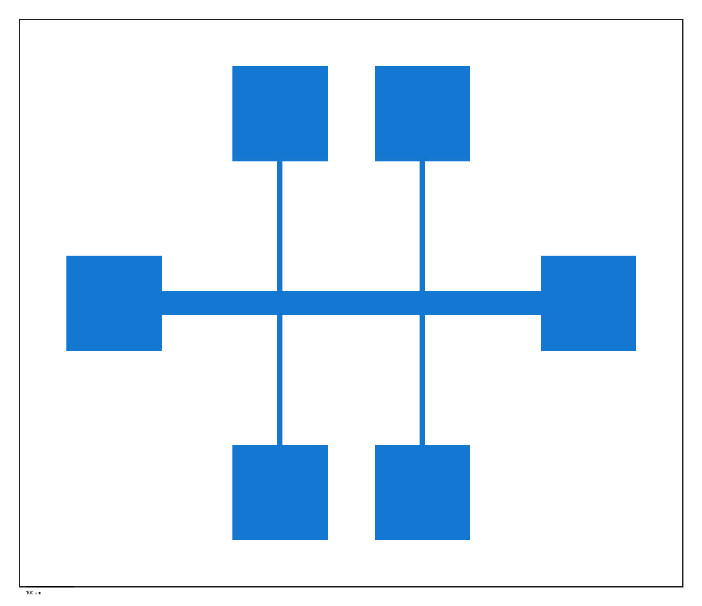
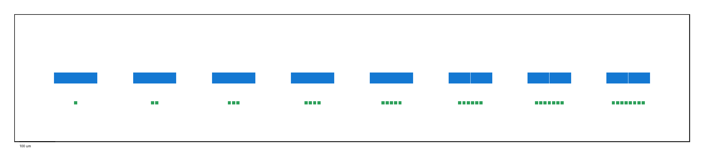

# Vibe Layout

Harness-based scaffold for building an intelligent KLayout design agent.

The project bridges high-level intent with precision GDS output by forcing each
request through three executable harnesses before a layout is accepted.

## Result Gallery

Representative generated previews are committed under `docs/images/` so the
GitHub project page shows the current layout capabilities at a glance.

| Electrode unit | Bio sensor micro-channel |
| --- | --- |
|  |  |
| `[Vibe_Layout] $1mm \times 1mm$ root cell 'CHIP_ROOT'. Create sub cell 'ELECTRODE_UNIT' with width $50\mu m$ and length $800\mu m$ on Microwriter layer (1, 0).` | `[Vibe_Layout] Design a bio sensor Micro-channel pattern. The fluid flow should be smooth and the reaction area should be large. Use Microwriter layer (1, 0).` |

| 6-terminal Hall bar | Nano-gap array |
| --- | --- |
|  |  |
| `[Vibe_Layout] Design a Standard 6-terminal Hall Bar for Quantum Hall Effect measurement. Use a 50um main channel width, 10um voltage leads, 200um x 200um bonding pads, and place the full device on layer (1, 0).` | `[Vibe_Layout] Design a tunneling effect Nano-gap array. Sweep the gap between two electrodes from 0.6um to 2.0um in 0.2um steps for 8 devices arranged horizontally. Keep 100um spacing between devices and add identifier box patterns on layer (2, 0).` |

## Architecture

- Semantic Harness: converts user intent into typed physical parameters in
  micrometers, resolves Microwriter defaults, and enforces fabrication-aware
  semantic constraints.
- Tool-Actuation Harness: generates layouts through parametric `klayout.db`
  operations hidden behind `CADHarness`.
- Verification Harness: validates DBU mapping, minimum resolution, positive
  closed rectangular geometry, layer usage, hierarchy, and real GDS readback.

The Microwriter minimum resolution rule is a hard `0.6 um` DRC limit.

## Quick Start

```powershell
python -m pip install -e .[dev,gds]
python -m pytest
```

KLayout Python bindings are loaded lazily. Unit tests use an in-memory backend,
so most tests can run before KLayout is installed. Real GDS generation requires
the `gds` extra or another installation that provides `klayout.db`.

## Generate From A Request

Use a PowerShell here-string so `$1mm` and `$50\mu m` are not interpreted as
variables:

```powershell
$prompt = @'
[Vibe_Layout] $1mm \times 1mm$ root cell 'CHIP_ROOT'. Create sub cell 'ELECTRODE_UNIT' with width $50\mu m$ and length $800\mu m$ on Microwriter layer (1, 0).
'@
vibe-layout $prompt --open
```

The CLI prints three required sections:

- Engineering Analysis
- Python Code
- Design Validation

The constrained electrode request creates a `CHIP_ROOT` cell, an
`ELECTRODE_UNIT` subcell, a centered `50 um x 800 um` electrode on layer
`(1, 0)`, and a `1 mm x 1 mm` root-cell frame.

## KLayout GUI

To open the generated file in the KLayout GUI on Windows, install KLayout GUI
and use one of these options:

```powershell
$env:KLAYOUT_EXE = "C:\Path\To\klayout.exe"
vibe-layout $prompt --open
```

or:

```powershell
vibe-layout $prompt --open --klayout-exe "C:\Path\To\klayout.exe"
```

If no executable is found, the CLI falls back to Windows `.gds` file
association.

## Realtime Server

Install server dependencies and start the localhost API:

```powershell
python -m pip install -e .[dev,gds,server]
$env:VIBE_LAYOUT_TOKEN = "local-dev-token"
vibe-layout-server --host 127.0.0.1 --port 8765
```

Create a layout job:

```powershell
$headers = @{ Authorization = "Bearer local-dev-token" }
$body = @{ prompt = $prompt; open_gui = $false } | ConvertTo-Json
Invoke-RestMethod -Uri "http://127.0.0.1:8765/api/layouts" -Method Post -Headers $headers -ContentType "application/json" -Body $body
```

Useful endpoints:

- `POST /api/layouts`
- `GET /api/layouts/{job_id}`
- `GET /api/layouts/{job_id}/preview.png`
- `GET /api/layouts/{job_id}/layout.gds`
- `WS /ws/jobs/{job_id}`

Successful `POST /api/layouts` responses include `viewer_url` and
`agent_action`. Agents should open `agent_action.url` inside their active
browser surface, such as the Codex in-app browser or Claude Code browser
preview. The Viewer URL is the canonical review surface; generated PNG, GDS,
and standalone HTML artifacts are secondary downloads.

The server stores generated artifacts under `build/jobs/{job_id}/` and requires
`Authorization: Bearer <token>` for API and WebSocket access.
